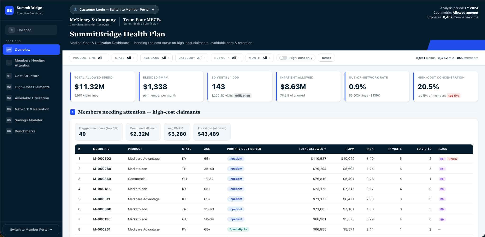

# SummitBridge Health Plan Analytics

A healthcare cost, utilization and retention analytics case developed by **Team Four MECEs, Delhi Technological University**, for the **McKinsey TechQuest case competition**.

The project integrates claims, enrollment, member-month, provider and avoidable-emergency-department reference data into a member-level analytical model and an interactive executive dashboard.

> **Portfolio note:** SummitBridge is a fictional case entity. This repository documents a case-competition analysis and does not represent work completed for McKinsey & Company, a real insurer or a healthcare client.

## Project Links

- **Live Dashboard:** https://mc-kinsey-casecomp-web.vercel.app/
- **Collaborative Dashboard Source:** https://github.com/ananyamangal/Halo

The dashboard source is maintained in the team's collaborative repository. This repository focuses on the analytical model, KPI definitions, scenario logic, documentation and portfolio evidence.

## Executive Summary

The 2024 analytical sample contained:

| Metric | Value |
|---|---:|
| Members | 800 |
| Member Months | 8,462 |
| Claim Lines | 5,961 |
| Total Allowed Spend | $11.321M |
| Blended PMPM | $1,338 |
| ED Claim Lines | 1,209 |
| Specialty Rx Spend | $791K |
| Disenrolled Members | 93 |

The analysis indicated a **concentration problem rather than a universal cost problem**:

- Inpatient services accounted for **76.2%** of allowed spend.
- The top **5% of members (40 members)** generated **20.5%** of total allowed spend.
- **914 ED claim lines** formed an avoidable or potentially avoidable candidate pool; clinical triage would still be required.
- Specialty pharmacy spend was concentrated enough for targeted review.
- Access, affordability and network factors were treated as retention-prioritization signals, not proof of causality.

## Analytical Approach

The team integrated five datasets:

1. **Claims** — cost, diagnosis, service category, provider and pharmacy information.
2. **Enrollment** — demographics, risk, geography, product line, attributed PCP and disenrollment reason.
3. **Member Months** — exposure denominator for PMPM and utilization rates.
4. **Providers** — specialty, network status, quality score and panel size.
5. **Avoidable ED Reference** — ICD-10-based classification for ED screening.

Core analytical workstreams included:

- Medical-cost concentration
- High-cost-member segmentation
- PMPM and utilization analysis
- ED avoidability and site-of-care economics
- Specialty Rx concentration and optimization scenarios
- Behavioral-health utilization
- Out-of-network leakage
- Member retention and access signals
- KPI design and implementation roadmap

## Key Findings

### Observed From the Case Data

- **$8.632M**, or **76.2%**, of allowed spend was inpatient.
- The top 5% cohort represented **$2.317M** and **20.5%** of allowed spend.
- ED represented **$1.362M** across **1,209 claim lines**, averaging approximately **$1,127**.
- Urgent care averaged approximately **$135**, creating a unit-level gap of about **$992** for clinically appropriate shifts.
- Specialty Rx represented approximately **$791K**.
- Churn was **11.6%**, with 93 disenrolled members.
- Out-of-network leakage was approximately **$138.7K**, or **1.23%** of allowed spend.

### Scenario-Based Opportunities

| Scenario | Gross Opportunity | Interpretation |
|---|---:|---|
| Direct Base | ~$201K | Strict ED diversion at 20% adoption plus 10% Specialty Rx optimization |
| Direct Upside | ~$300K | Expanded ED candidate pool at 20% adoption plus 15% Specialty Rx optimization |
| Broader Five-Lever Scenario | ~$653K | Adds high-cost care-management and behavioral-health scenarios |
| Integrated Operating Upside | ~$1.2M | Illustrative long-term scenario using stronger assumptions |

All opportunity estimates are **gross, scenario-based and unvalidated**. They exclude program cost, clinical exclusions, implementation constraints and adoption risk.

## KPI Framework

The dashboard and operating model were designed around:

- Per Member Per Month cost
- ED Claim Lines per 1,000 Member Months
- High-Cost Member Concentration
- Inpatient Allowed Spend
- Specialty Rx Allowed Spend
- Out-of-Network Leakage Rate
- Member Churn Rate
- PCP Follow-Up
- Urgent-Care Conversion
- 30-Day Readmissions
- Medication Adherence
- Member Complaints

See [`Documentation/KPI-Definitions.md`](Documentation/KPI-Definitions.md) for formulas and interpretation.

## Dashboard



Additional views:

- [Cost Structure and Trends](Dashboard/Cost-Structure-And-Trends.png)
- [High-Cost and Avoidable Utilization](Dashboard/High-Cost-And-Avoidable-Utilization.png)
- [Network, Retention and Savings Model](Dashboard/Network-Retention-And-Savings-Model.png)

The dashboard converts a one-time case analysis into a repeatable management view for cost, utilization, access and retention.

## Repository Structure

```text
SummitBridge-Health-Plan-Analytics/
├── README.md
├── NOTICE.md
├── .gitignore
├── Analysis/
│   ├── SummitBridge-Health-Plan-Analysis.xlsx
│   └── Analysis-Guide.md
├── Data/
│   ├── SummitBridge-Case-Data.xlsx
│   ├── Data-Dictionary.md
│   └── README.md
├── Dashboard/
│   ├── Dashboard-Overview.png
│   ├── Cost-Structure-And-Trends.png
│   ├── High-Cost-And-Avoidable-Utilization.png
│   ├── Network-Retention-And-Savings-Model.png
│   └── README.md
├── Documentation/
│   ├── Methodology.md
│   ├── KPI-Definitions.md
│   ├── Savings-Scenarios.md
│   ├── Implementation-Roadmap.md
│   ├── Team-Contributions.md
│   ├── Limitations-And-Guardrails.md
│   └── Case-Deck.md
└── Outputs/
    ├── Key-Metrics.csv
    ├── KPI-Framework.csv
    ├── Savings-Scenarios.csv
    └── Intervention-Roadmap.csv
```

## Personal Contribution — Shivam Mittal

This was a four-member team project. My primary contribution focused on:

- Defining and validating the KPI framework, including PMPM, utilization, high-cost concentration, churn and out-of-network leakage.
- Analyzing the workbook to identify cost concentration, high-cost cohorts, ED opportunity, Specialty Rx concentration and retention signals.
- Building and reconciling savings scenarios, including the direct **$201K–$300K** range and the broader **~$653K** scenario.
- Shaping the phased implementation roadmap, executive storyline, intervention priorities and quality guardrails.
- Contributing to the dashboard structure and the translation of analytical outputs into decision-ready management views.

The final recommendations, dashboard and presentation were collaborative team deliverables.

## Team

**Team Four MECEs — Delhi Technological University**

- Adarsh Ranjan
- Shivam Mittal
- Akansha Sethi
- Ananya Mangal

## Important Limitations

- The dataset represents a case-competition sample, not a full enterprise population.
- ED claim lines were treated as visits because that was the supplied case definition; a production model should group lines into encounter episodes.
- Avoidable and potentially avoidable ED classifications define a screening pool, not automatic redirection eligibility.
- Retention analysis identifies associations, not causal relationships.
- Savings are gross opportunities and must be validated through pilots, clinical governance and quality monitoring.
- The integrated $1.2M scenario is illustrative and should not be presented as the validated base case.

## Tools and Skills Demonstrated

- Microsoft Excel
- XLOOKUP and SUMIFS
- Member-level aggregation
- KPI design
- Scenario modeling
- Cost and utilization analytics
- Customer/member segmentation
- Dashboard design
- Structured problem solving
- Executive communication

## Suggested Resume Wording

> **SummitBridge Health Plan Analytics | McKinsey TechQuest**

- Analyzed five integrated datasets covering 800 members, 5,961 claim lines and $11.3M in allowed spend to identify inpatient concentration, high-cost cohorts and retention signals.
- Defined KPI and scenario frameworks across PMPM, ED utilization, churn and Specialty Rx, estimating a $201K–$300K gross opportunity before program costs and clinical validation.
- Co-developed an interactive executive dashboard and phased intervention roadmap covering high-cost care management, ED navigation, pharmacy optimization and member retention.
